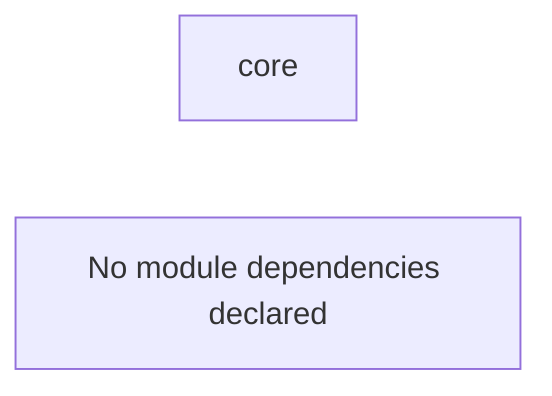

# Architecture

Este documento se genera automaticamente a partir de los `module.yaml` y frontmatter de los documentos por modulo en `docs/handbook/*/`. Su objetivo es mantener una vista de arquitectura actualizada sin edicion manual del contenido tecnico principal.

## System Snapshot

- generated_at: `2026-03-14T22:49:14Z`
- modules: `1`
- module_docs: `0`

## Module Dependency Graph

## Module Index

### Core (`core`)

- description: Estructura base, configuración y documentación del proyecto.
- functions: `0`
- depends_on: None
- tracking_entries: `3`
- docs: `0`
