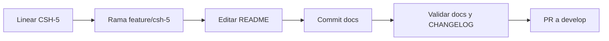

# Objetivo

Este documento recorre un **ejemplo concreto** de flujo de trabajo: desde un issue en Linear hasta un PR a `develop`. Sirve como guía paso a paso; el flujo formal está en [Ciclo de vida de desarrollo](ciclo-vida-desarrollo.md).

**Caso de ejemplo:** tarea de documentación (DOC) — añadir una sección "Contribuir" en el README del proyecto.

---

# Escenario

- **Issue en Linear:** CSH-5 – DOC: Añadir sección "Contribuir" en README
- **Criterios de aceptación:** README incluye una sección "Contribuir" con enlace a docs (tutoriales y proceso) y una frase sobre PRs a `develop`.
- **Rama:** `feature/csh-5-readme-contribuir`

---

# Pasos del ejemplo

## 0) Inicio de tarea

- En Linear se revisa el issue CSH-5: título, descripción y criterios de aceptación.
- Se confirma que el cambio es solo en `README.md` y no afecta código.

**Salida:** alcance claro (solo README, sección Contribuir).

## 1) Rama y planificación

Desde la raíz del repo, con `develop` actualizado:

```bash
git checkout develop
git pull
git checkout -b feature/csh-5-readme-contribuir
```

Opcional: crear una nota de trabajo en `docs/work/feature/csh-5-readme-contribuir/` (por ejemplo `plan.md`) con el plan en una frase: "Añadir sección Contribuir en README con enlace a docs/tutorials y mención de PR a develop."

**Salida:** rama creada y, si aplica, borrador en `docs/work/...`.

## 2) Implementación y commit

- Se edita [README.md](../../README.md): se añade una sección "Contribuir" con:
  - Enlace a `docs/` o a `docs/tutorials` y proceso (p. ej. [Ciclo de vida de desarrollo](ciclo-vida-desarrollo.md)).
  - Una línea indicando que los cambios se integran vía PR a `develop`.
- Se guarda el archivo.

Commit siguiendo [commit.md](commit.md) (tipo `docs`, título corto, bullets si aportan):

```bash
git add README.md
git commit -m "docs: Add Contribuir section to README

- Add section with link to docs and development process.
- Mention PRs to develop as contribution path.
Reason: Fulfill CSH-5 acceptance criteria."
```

**Salida:** un commit atómico en la rama.

## 3) Testing

- Para un cambio solo de documentación: revisión manual (leer README en el navegador o en el repo).
- Se comprueba que los enlaces funcionan y que la sección se ve correctamente.

**Salida:** pasos de prueba claros para incluir en el PR (p. ej. "Abrir README en GitHub y comprobar sección Contribuir y enlaces").

## 4) Cierre documental

- Si se tocó documentación en `docs/`, se ejecuta la validación:

```bash
python .cursor/skills/docs-governor/scripts/check_doc_validation.py --root .
```

- Se actualiza [CHANGELOG.md](../../CHANGELOG.md) con la entrada correspondiente a esta rama (bajo "Unreleased" o la versión en curso), por ejemplo:

  - `- DOC: Add Contribuir section to README (CSH-5).`

**Salida:** validación en verde y CHANGELOG actualizado.

## 5) Pull Request

- Se sube la rama al remoto y se abre un PR hacia `develop`.
- Se usa la [plantilla de PR](pull-request-template.md) y se rellena, por ejemplo:

| Sección      | Ejemplo |
|-------------|---------|
| Descripción | Añade la sección "Contribuir" al README con enlace a docs y mención de PRs a develop. |
| Issue       | CSH-5 – [DOC: Añadir sección Contribuir en README](url-del-issue-linear) |
| Tipo        | `docs` |
| Cómo probar | 1. Abrir README en GitHub. 2. Comprobar que existe la sección "Contribuir" y que los enlaces llevan a docs/tutorials y proceso. |
| Checklist   | Marcar según lo realizado (rama, pruebas, validación doc, CHANGELOG). |

- Se asigna revisor según criterio del equipo.

**Salida:** PR listo para revisión.

---

# Resumen del flujo



# Referencias rápidas

| Qué necesitas | Dónde |
|---------------|--------|
| Flujo completo y DoD | [Ciclo de vida de desarrollo](ciclo-vida-desarrollo.md) |
| Formato de commits | [Commit de trabajo actual](commit.md) |
| Contenido del PR | [Plantilla para Pull Request](pull-request-template.md) |
| Levantar el proyecto | [Levantar proyecto](levantar-proyecto.md) |
